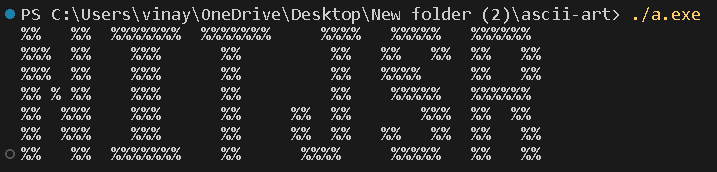

	 

 
 

---

## Table of contents

- [Overview](https://github.com/codewithnick/ascii-art#overview)
- [Usage](https://github.com/codewithnick/ascii-art#Usage)

  - [Seven Star](https://github.com/codewithnick/ascii-art#1-Seven-Star)
  - [Boomer](https://github.com/codewithnick/ascii-art#2-Boomer)
  - [Carlos](https://github.com/codewithnick/ascii-art#3-Carlos)
  - [Straight](https://github.com/codewithnick/ascii-art#4-Straight)
  - [Starwar](https://github.com/codewithnick/ascii-art#5-Starwar)
  - [AmongUs](https://github.com/codewithnick/ascii-art#6-AmongUs)
  - [Banner](https://github.com/codewithnick/ascii-art#7-Banner)
  - [DrPepper](https://github.com/codewithnick/ascii-art#8-DrPepper)
  - [Block](https://github.com/codewithnick/ascii-art#9-Block)
  - [Small](https://github.com/codewithnick/ascii-art#10-Small)

- [Contribution](https://github.com/codewithnick/ascii-art/blob/main/CONTRIBUTING.md)
- [Reference](https://github.com/codewithnick/ascii-art#Reference)
- [Authors](https://github.com/codewithnick/ascii-art#Authors)
- [Show Your Support](https://github.com/codewithnick/ascii-art#Show-your-support)

## Overview

ASCII-ART C++ Library 🚀 This is a C++ library for generating ASCII art in various fonts and styles. It is a port of the popular Python library of the same name.
Features 🎉 Supports a variety of fonts, including standard fonts, decorative fonts, and monospace fonts. ⭐ Allows users to print characters and letters in different styles, such as bold, italic, and underlined. 💥 Provides a simple and easy-to-use API. 🔨

## Usage

 

 
<strong>Result</strong>
 
 

### 1-[Seven star](./Fonts/SevenStar/sevenstar.md)

### 2-[Boomer](./Fonts/Boomer/boomer.md)

### 3-[Carlos](./Fonts/carlos/carlos.md)

### 4-[Straight](./Fonts/Straight/straight.md)

### 5-[Starwar](./Fonts/starwar/starwar.md)

### 6-[AmongUs](./Fonts/amongus/amongus.md)

### 7-[Banner](./Fonts/banner/banner.md)

### 8-[DrPepper](./Fonts/drpepper/drpepper.md)

### 9-[Block](./Fonts/block/block.md)

### 10-[Small](./Fonts/small/small.md)

## Reference

1. [Art 6.1](https://pypi.org/project/art/)
2. [Ascii Generator](https://ascii-generator.site/t/)

## Authors

### Collaborators

<!-- readme: collaborators -start -->
<table>
<tr>
    <td align="center">
        <a href="https://github.com/codewithnick">
            
             
            <b>codewithnick</b>
        </a>
    </td>
    <td align="center">
        <a href="https://github.com/AnshumanMahato">
            
             
            <b>AnshumanMahato</b>
        </a>
    </td>
    <td align="center">
        <a href="https://github.com/vkumar8192449">
            
             
            <b>vkumar8192449</b>
        </a>
    </td>
    <td align="center">
        <a href="https://github.com/vishu567">
            
             
            <b>vishu567</b>
        </a>
    </td>
    <td align="center">
        <a href="https://github.com/sachinkumar911">
            
             
            <b>sachinkumar911</b>
        </a>
    </td></tr>
</table>
<!-- readme: collaborators -end -->

### Contributors

<!-- readme: contributors,codewithnick/-,vkumar8192449/-,vishu567/-,sachinkumar911/-,AnshumanMahato/- -start -->
<table>
<tr>
    <td align="center">
        <a href="https://github.com/AnshumanMahato">
            
             
            <b>AnshumanMahato</b>
        </a>
    </td>
    <td align="center">
        <a href="https://github.com/NeerajSh-16">
            
             
            <b>NeerajSh-16</b>
        </a>
    </td>
    <td align="center">
        <a href="https://github.com/komal7141">
            
             
            <b>komal7141</b>
        </a>
    </td>
    <td align="center">
        <a href="https://github.com/Harry121199">
            
             
            <b>Harry121199</b>
        </a>
    </td>
    <td align="center">
        <a href="https://github.com/jlewismith">
            
             
            <b>jlewismith</b>
        </a>
    </td>
    <td align="center">
        <a href="https://github.com/nakul-py">
            
             
            <b>nakul-py</b>
        </a>
    </td></tr>
<tr>
    <td align="center">
        <a href="https://github.com/Rishisihare90">
            
             
            <b>Rishisihare90</b>
        </a>
    </td>
    <td align="center">
        <a href="https://github.com/alucard017">
            
             
            <b>alucard017</b>
        </a>
    </td>
    <td align="center">
        <a href="https://github.com/rishavr920">
            
             
            <b>rishavr920</b>
        </a>
    </td>
    <td align="center">
        <a href="https://github.com/sakshidewangan">
            
             
            <b>sakshidewangan</b>
        </a>
    </td>
    <td align="center">
        <a href="https://github.com/PRIYANSHU210021">
            
             
            <b>PRIYANSHU210021</b>
        </a>
    </td>
    <td align="center">
        <a href="https://github.com/Sukriti-Rai">
            
             
            <b>Sukriti-Rai</b>
        </a>
    </td></tr>
<tr>
    <td align="center">
        <a href="https://github.com/moniiccaaa">
            
             
            <b>moniiccaaa</b>
        </a>
    </td>
    <td align="center">
        <a href="https://github.com/XARTAN21">
            
             
            <b>XARTAN21</b>
        </a>
    </td>
    <td align="center">
        <a href="https://github.com/im0vishal">
            
             
            <b>im0vishal</b>
        </a>
    </td>
    <td align="center">
        <a href="https://github.com/abhay5624">
            
             
            <b>abhay5624</b>
        </a>
    </td>
    <td align="center">
        <a href="https://github.com/J-Madhusmita">
            
             
            <b>J-Madhusmita</b>
        </a>
    </td>
    <td align="center">
        <a href="https://github.com/gourabbistu089">
            
             
            <b>gourabbistu089</b>
        </a>
    </td></tr>
<tr>
    <td align="center">
        <a href="https://github.com/ShubhamJatavBankai">
            
             
            <b>ShubhamJatavBankai</b>
        </a>
    </td>
    <td align="center">
        <a href="https://github.com/chengm405">
            
             
            <b>chengm405</b>
        </a>
    </td>
    <td align="center">
        <a href="https://github.com/Shivansh-243">
            
             
            <b>Shivansh-243</b>
        </a>
    </td>
    <td align="center">
        <a href="https://github.com/gulshankapse">
            
             
            <b>gulshankapse</b>
        </a>
    </td>
    <td align="center">
        <a href="https://github.com/RITIK-DEVOLOPER">
            
             
            <b>RITIK-DEVOLOPER</b>
        </a>
    </td>
    <td align="center">
        <a href="https://github.com/ranveer-2301">
            
             
            <b>ranveer-2301</b>
        </a>
    </td></tr>
<tr>
    <td align="center">
        <a href="https://github.com/ipratiik">
            
             
            <b>ipratiik</b>
        </a>
    </td>
    <td align="center">
        <a href="https://github.com/AlexWeb07">
            
             
            <b>AlexWeb07</b>
        </a>
    </td>
    <td align="center">
        <a href="https://github.com/codewithana">
            
             
            <b>codewithana</b>
        </a>
    </td>
    <td align="center">
        <a href="https://github.com/Stunner33">
            
             
            <b>Stunner33</b>
        </a>
    </td>
    <td align="center">
        <a href="https://github.com/mohdadil1">
            
             
            <b>mohdadil1</b>
        </a>
    </td>
    <td align="center">
        <a href="https://github.com/pronajit">
            
             
            <b>pronajit</b>
        </a>
    </td></tr>
<tr>
    <td align="center">
        <a href="https://github.com/vishalmishraa">
            
             
            <b>vishalmishraa</b>
        </a>
    </td>
    <td align="center">
        <a href="https://github.com/s-xiae">
            
             
            <b>s-xiae</b>
        </a>
    </td>
    <td align="center">
        <a href="https://github.com/nk12nidhi12">
            
             
            <b>nk12nidhi12</b>
        </a>
    </td>
    <td align="center">
        <a href="https://github.com/suraj2402">
            
             
            <b>suraj2402</b>
        </a>
    </td>
    <td align="center">
        <a href="https://github.com/smedha99">
            
             
            <b>smedha99</b>
        </a>
    </td>
    <td align="center">
        <a href="https://github.com/Bhargava-1103">
            
             
            <b>Bhargava-1103</b>
        </a>
    </td></tr>
<tr>
    <td align="center">
        <a href="https://github.com/Sangam02">
            
             
            <b>Sangam02</b>
        </a>
    </td>
    <td align="center">
        <a href="https://github.com/Anuj-cel">
            
             
            <b>Anuj-cel</b>
        </a>
    </td>
    <td align="center">
        <a href="https://github.com/IshitaPathak">
            
             
            <b>IshitaPathak</b>
        </a>
    </td>
    <td align="center">
        <a href="https://github.com/vaishnavisisodiya">
            
             
            <b>vaishnavisisodiya</b>
        </a>
    </td>
    <td align="center">
        <a href="https://github.com/aryantanwarr">
            
             
            <b>aryantanwarr</b>
        </a>
    </td>
    <td align="center">
        <a href="https://github.com/Odin5133">
            
             
            <b>Odin5133</b>
        </a>
    </td></tr>
<tr>
    <td align="center">
        <a href="https://github.com/gaurav12devloper">
            
             
            <b>gaurav12devloper</b>
        </a>
    </td>
    <td align="center">
        <a href="https://github.com/Arif20484423">
            
             
            <b>Arif20484423</b>
        </a>
    </td>
    <td align="center">
        <a href="https://github.com/prateek00077">
            
             
            <b>prateek00077</b>
        </a>
    </td>
    <td align="center">
        <a href="https://github.com/Atul-Xalxo">
            
             
            <b>Atul-Xalxo</b>
        </a>
    </td>
    <td align="center">
        <a href="https://github.com/rudra-iitm">
            
             
            <b>rudra-iitm</b>
        </a>
    </td>
    <td align="center">
        <a href="https://github.com/itsAbhishekpatel01">
            
             
            <b>itsAbhishekpatel01</b>
        </a>
    </td></tr>
<tr>
    <td align="center">
        <a href="https://github.com/ankitkujur15">
            
             
            <b>ankitkujur15</b>
        </a>
    </td>
    <td align="center">
        <a href="https://github.com/P00P-head">
            
             
            <b>P00P-head</b>
        </a>
    </td>
    <td align="center">
        <a href="https://github.com/Mystery-glitch">
            
             
            <b>Mystery-glitch</b>
        </a>
    </td>
    <td align="center">
        <a href="https://github.com/anchaldubey123">
            
             
            <b>anchaldubey123</b>
        </a>
    </td>
    <td align="center">
        <a href="https://github.com/choidf">
            
             
            <b>choidf</b>
        </a>
    </td>
    <td align="center">
        <a href="https://github.com/shivamgupta1990">
            
             
            <b>shivamgupta1990</b>
        </a>
    </td></tr>
<tr>
    <td align="center">
        <a href="https://github.com/vishallmaurya">
            
             
            <b>vishallmaurya</b>
        </a>
    </td>
    <td align="center">
        <a href="https://github.com/sandeep131431">
            
             
            <b>sandeep131431</b>
        </a>
    </td>
    <td align="center">
        <a href="https://github.com/PranjalKhatri">
            
             
            <b>PranjalKhatri</b>
        </a>
    </td>
    <td align="center">
        <a href="https://github.com/gourshabrg">
            
             
            <b>gourshabrg</b>
        </a>
    </td>
    <td align="center">
        <a href="https://github.com/Kranti-Kumar">
            
             
            <b>Kranti-Kumar</b>
        </a>
    </td>
    <td align="center">
        <a href="https://github.com/jonbrohauge">
            
             
            <b>jonbrohauge</b>
        </a>
    </td></tr>
<tr>
    <td align="center">
        <a href="https://github.com/khalid10906">
            
             
            <b>khalid10906</b>
        </a>
    </td>
    <td align="center">
        <a href="https://github.com/Priyanshu-kr-gupta">
            
             
            <b>Priyanshu-kr-gupta</b>
        </a>
    </td>
    <td align="center">
        <a href="https://github.com/himanshigupta22">
            
             
            <b>himanshigupta22</b>
        </a>
    </td>
    <td align="center">
        <a href="https://github.com/hellomohit722">
            
             
            <b>hellomohit722</b>
        </a>
    </td>
    <td align="center">
        <a href="https://github.com/miragearush">
            
             
            <b>miragearush</b>
        </a>
    </td>
    <td align="center">
        <a href="https://github.com/Bhaveshgupta00">
            
             
            <b>Bhaveshgupta00</b>
        </a>
    </td></tr>
<tr>
    <td align="center">
        <a href="https://github.com/som02esh">
            
             
            <b>som02esh</b>
        </a>
    </td>
    <td align="center">
        <a href="https://github.com/ahmad-kaif">
            
             
            <b>ahmad-kaif</b>
        </a>
    </td>
    <td align="center">
        <a href="https://github.com/akashKumar06">
            
             
            <b>akashKumar06</b>
        </a>
    </td>
    <td align="center">
        <a href="https://github.com/Manas-Pathak">
            
             
            <b>Manas-Pathak</b>
        </a>
    </td>
    <td align="center">
        <a href="https://github.com/pris01">
            
             
            <b>pris01</b>
        </a>
    </td>
    <td align="center">
        <a href="https://github.com/ben-dh3">
            
             
            <b>ben-dh3</b>
        </a>
    </td></tr>
<tr>
    <td align="center">
        <a href="https://github.com/Zeref-XXX">
            
             
            <b>Zeref-XXX</b>
        </a>
    </td>
    <td align="center">
        <a href="https://github.com/Sriparno08">
            
             
            <b>Sriparno08</b>
        </a>
    </td>
    <td align="center">
        <a href="https://github.com/shlok-2003">
            
             
            <b>shlok-2003</b>
        </a>
    </td>
    <td align="center">
        <a href="https://github.com/mrsaurabhnamdev">
            
             
            <b>mrsaurabhnamdev</b>
        </a>
    </td>
    <td align="center">
        <a href="https://github.com/LeenaMondal01">
            
             
            <b>LeenaMondal01</b>
        </a>
    </td>
    <td align="center">
        <a href="https://github.com/avi-dey">
            
             
            <b>avi-dey</b>
        </a>
    </td></tr>
<tr>
    <td align="center">
        <a href="https://github.com/Anshuln28">
            
             
            <b>Anshuln28</b>
        </a>
    </td>
    <td align="center">
        <a href="https://github.com/12345rams">
            
             
            <b>12345rams</b>
        </a>
    </td>
    <td align="center">
        <a href="https://github.com/mohit-8692">
            
             
            <b>mohit-8692</b>
        </a>
    </td>
    <td align="center">
        <a href="https://github.com/Raghav354">
            
             
            <b>Raghav354</b>
        </a>
    </td>
    <td align="center">
        <a href="https://github.com/harshvyas-22">
            
             
            <b>harshvyas-22</b>
        </a>
    </td>
    <td align="center">
        <a href="https://github.com/krishna16sharma">
            
             
            <b>krishna16sharma</b>
        </a>
    </td></tr>
<tr>
    <td align="center">
        <a href="https://github.com/NANDANA-S-P">
            
             
            <b>NANDANA-S-P</b>
        </a>
    </td>
    <td align="center">
        <a href="https://github.com/VikashBurman">
            
             
            <b>VikashBurman</b>
        </a>
    </td>
    <td align="center">
        <a href="https://github.com/ayoitsamishaa">
            
             
            <b>ayoitsamishaa</b>
        </a>
    </td>
    <td align="center">
        <a href="https://github.com/adripo">
            
             
            <b>adripo</b>
        </a>
    </td>
    <td align="center">
        <a href="https://github.com/FreemRL">
            
             
            <b>FreemRL</b>
        </a>
    </td>
    <td align="center">
        <a href="https://github.com/jaivardhan-bhola">
            
             
            <b>jaivardhan-bhola</b>
        </a>
    </td></tr>
<tr>
    <td align="center">
        <a href="https://github.com/Yordaniss">
            
             
            <b>Yordaniss</b>
        </a>
    </td>
    <td align="center">
        <a href="https://github.com/verma-divyanshu-git">
            
             
            <b>verma-divyanshu-git</b>
        </a>
    </td>
    <td align="center">
        <a href="https://github.com/JakeKilled4">
            
             
            <b>JakeKilled4</b>
        </a>
    </td>
    <td align="center">
        <a href="https://github.com/Fictionistique">
            
             
            <b>Fictionistique</b>
        </a>
    </td>
    <td align="center">
        <a href="https://github.com/AryanBakliwal">
            
             
            <b>AryanBakliwal</b>
        </a>
    </td>
    <td align="center">
        <a href="https://github.com/AmitRajput1772">
            
             
            <b>AmitRajput1772</b>
        </a>
    </td></tr>
<tr>
    <td align="center">
        <a href="https://github.com/42Abhishek">
            
             
            <b>42Abhishek</b>
        </a>
    </td>
    <td align="center">
        <a href="https://github.com/vinaytheprogrammer">
            
             
            <b>vinaytheprogrammer</b>
        </a>
    </td>
    <td align="center">
        <a href="https://github.com/prungoose">
            
             
            <b>prungoose</b>
        </a>
    </td>
    <td align="center">
        <a href="https://github.com/abhishekyadav76">
            
             
            <b>abhishekyadav76</b>
        </a>
    </td>
    <td align="center">
        <a href="https://github.com/zpotthoff">
            
             
            <b>zpotthoff</b>
        </a>
    </td>
    <td align="center">
        <a href="https://github.com/Talm28">
            
             
            <b>Talm28</b>
        </a>
    </td></tr>
<tr>
    <td align="center">
        <a href="https://github.com/Sunilbehera672">
            
             
            <b>Sunilbehera672</b>
        </a>
    </td>
    <td align="center">
        <a href="https://github.com/sarthaknimbalkar">
            
             
            <b>sarthaknimbalkar</b>
        </a>
    </td>
    <td align="center">
        <a href="https://github.com/prajjawal007">
            
             
            <b>prajjawal007</b>
        </a>
    </td>
    <td align="center">
        <a href="https://github.com/ManavMehta123">
            
             
            <b>ManavMehta123</b>
        </a>
    </td>
    <td align="center">
        <a href="https://github.com/Mounayer">
            
             
            <b>Mounayer</b>
        </a>
    </td>
    <td align="center">
        <a href="https://github.com/iallah1">
            
             
            <b>iallah1</b>
        </a>
    </td></tr>
<tr>
    <td align="center">
        <a href="https://github.com/GriffinAnnshual">
            
             
            <b>GriffinAnnshual</b>
        </a>
    </td>
    <td align="center">
        <a href="https://github.com/selamanse">
            
             
            <b>selamanse</b>
        </a>
    </td>
    <td align="center">
        <a href="https://github.com/weshaan">
            
             
            <b>weshaan</b>
        </a>
    </td>
    <td align="center">
        <a href="https://github.com/Divyanshu723">
            
             
            <b>Divyanshu723</b>
        </a>
    </td>
    <td align="center">
        <a href="https://github.com/divyam09srivastava">
            
             
            <b>divyam09srivastava</b>
        </a>
    </td>
    <td align="center">
        <a href="https://github.com/BidyasagarAnupam">
            
             
            <b>BidyasagarAnupam</b>
        </a>
    </td></tr>
<tr>
    <td align="center">
        <a href="https://github.com/Abdelra6">
            
             
            <b>Abdelra6</b>
        </a>
    </td></tr>
</table>
<!-- readme: contributors,codewithnick/-,vkumar8192449/-,vishu567/-,sachinkumar911/-,AnshumanMahato/- -end -->

## Show your support

<h3>Star this repo</h3>

Give a ⭐ if you like this project !
